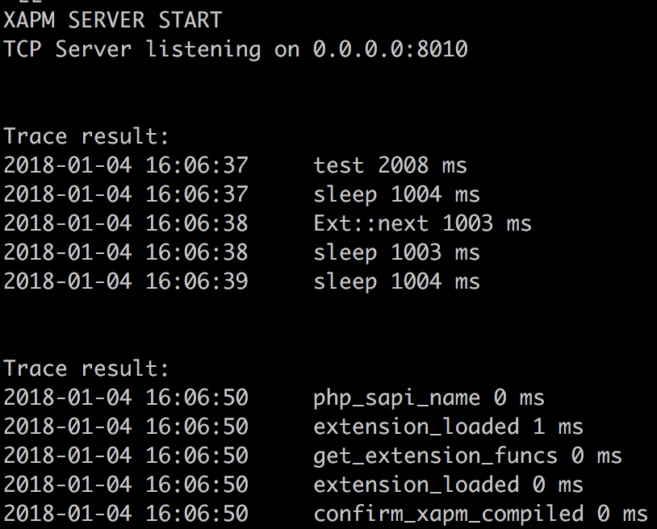

[](https://travis-ci.org/tanhaipeng/XAPM)

## XAPM : An extension for PHP Trace

> 为了更好的跟踪PHP执行链路开发此扩展，传统跟踪方法需要在代码层加入Log信息从而获得链路信息，而且不同框架之间的Log方法也不一定能有效兼容。我们扩展的优点是代码层无需修改，启用so扩展后可自动获取代码执行链路，实现开发框架与Trace信息获取的解耦。

### XAPM架构
扩展端(xapm)负责收集底层性能数据，缓存成文件形式，每隔一段时间通过TCP协议传输到服务端(xserver)，服务端解析trace数据，排序组合成结构化信息输出&持久化存储。

### Trace数据
* 类/函数(√)
* 执行耗时(√)
* 代码文件(dev)
* 代码行号(dev)
* 输入输出(dev)
* SQL慢查询分析
* 调用链可视化

### 使用方式
#### 扩展端
（1）编译源码
```
cd ext-src
sh build.sh
```

（2）module目录下的`xapm.so`文件拷贝到PHP extension目录

（3）php.ini启用扩展，并配置服务端信息
```
extension=xapm.so
[xapm]
xapm.server_ip=127.0.0.1  # 服务端IP
xapm.server_port=8010     # 服务端PORT
xapm.log_path=/tmp/trace.log   # 缓冲文件路径
```

（4）重启php-fpm

#### 服务端
（1）编译源码
```
cd srv-src
sh build.sh
```

（2）修改`config.json`
```
"Port": "8010"    # 服务端PORT
"MaxSize": 1024   # 缓冲区大小
"Logpath": "log/xserver.log"   # 日志路径
```

（3）启动xserver
```
#推荐使用supervisor，可以用下面方式测试
nohup ./xserver &
```

### Trace效果


